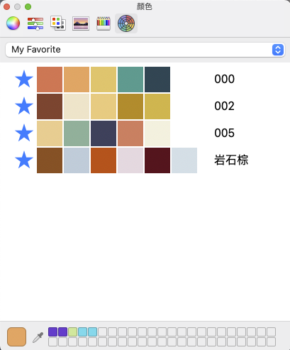

# 多彩 [](https://travis-ci.com/pythias/color-picker-macos)

苹果系统调色版插件



## 配色来源

- [中国色](http://zhongguose.com/)
- [NIPPON COLORS - 日本の伝統色](https://nipponcolors.com/)
- [Adobe潮流](https://color.adobe.com/zh/trends)
- [Coolors](https://coolors.co/palettes/trending)

##  安装

```bash
unzip DuoColorPicker.colorPicker.zip -d ~/Library/ColorPickers
```
